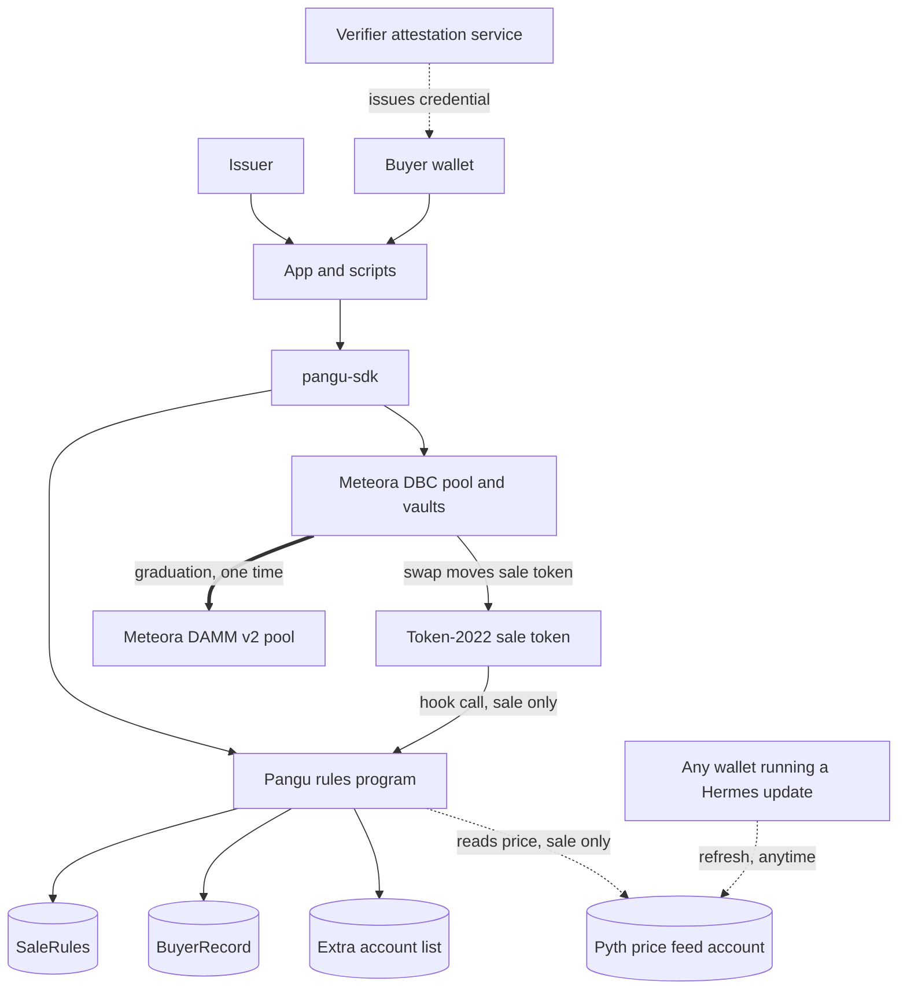
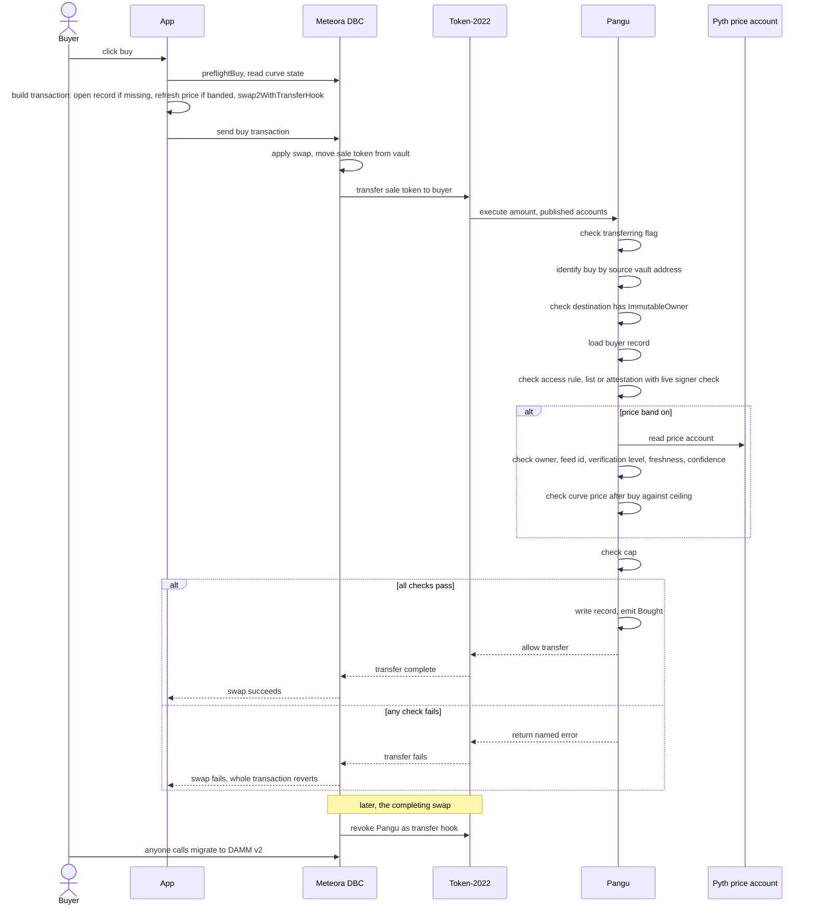
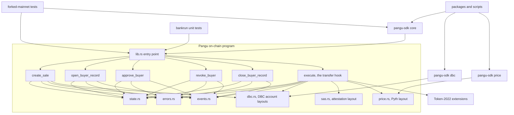

# Pangu architecture

Pangu is a rules program that Meteora's Dynamic Bonding Curve (DBC) attaches to a newly launched stock token for the length of its first sale. DBC finds the price. Pangu decides who may receive tokens and how many. When the sale fills, DBC removes Pangu from the token for good.

## Diagrams

### 1. System overview

The dotted arrows only exist while the sale is open: the hook call from Token-2022, Pangu's read of the price account, and the verifier's credential. The double arrow to DAMM v2 fires once, at graduation, and nothing points from Pangu to DAMM because Pangu is never called again after that trade.

### 2. Main sequence: one buy end to end

The checks run in the order shown, and the first one that fails ends the whole transaction, DBC's swap included, with the named error. The last two lines happen on a separate, later transaction: the swap that fills the curve is the one where DBC removes Pangu as the hook, and after that any wallet, not just the buyer, can call the migration.

### 3. Module dependency graph

`execute`, the transfer hook, is the only instruction that touches all three outside layouts (DBC, the attestation service, Pyth) plus Token-2022's extensions, which is why it carries almost every invariant in the threat model. The bankrun tests exercise the program directly and in isolation; the forked-mainnet tests go through the SDK against real cloned DBC and DAMM v2 programs.

## Fixed facts from DBC (verified on mainnet, 21 Sep 2026)

| Fact | Value |
|---|---|
| DBC program | `dbcij3LWUppWqq96dh6gJWwBifmcGfLSB5D4DuSMaqN` (mainnet and devnet) |
| DBC pool authority (owner of every pool vault) | `FhVo3mqL8PW5pH5U2CN4XE33DokiyZnUwuGpH2hmHLuM` |
| Hook pool account (`TransferHookPool`) | 424 bytes, discriminator `[237,219,184,23,42,189,169,35]` |
| Offsets inside the pool account | `config` 72, `creator` 104, `base_mint` 136, `base_vault` 168, `quote_vault` 200, `sqrt_price` (u128) 280 |
| Base vault address | PDA of DBC, seeds `["token_vault", base_mint, pool]` |
| Hook config account (`ConfigWithTransferHook`) | 1128 bytes, discriminator `[40,220,194,251,41,199,123,253]`, hook program id at offset 1048 |
| Token program of the sale token | Token-2022, extensions: metadata pointer, token metadata, transfer hook. No freeze authority. |

## Accounts Pangu owns

**SaleRules**, one per sale token. PDA seeds `["sale", mint]`.

| Field | Type | Meaning |
|---|---|---|
| `mint` | Pubkey | the sale token |
| `pool` | Pubkey | the DBC hook pool |
| `base_vault` | Pubkey | the pool's token vault, read from the pool account at creation |
| `issuer` | Pubkey | the pool creator. The only key that can approve buyers |
| `cap` | u64 | most tokens one wallet may hold net of sells, in raw units. Must be above zero |
| `access_mode` | u8 | 0 open (cap only), 1 issuer list, 2 verifier credential |
| `credential` | Pubkey | mode 2: the attestation credential that counts. Zero otherwise |
| `schema` | Pubkey | mode 2: the attestation schema that counts. Zero otherwise |
| `price_account` | Pubkey | band only: the Pyth price feed account, at byte 209, the PDA of the price feed program `pythWSnswVUd12oZpeFP8e9CVaEqJg25g1Vtc2biRsT` from (Pangu's shard id, feed id). Owned by the Pyth receiver program. Zero when no band. (Switchboard until 22 Sep 2026; it shut down on 25 Sep 2026) |
| `price_feed_id` | [u8; 32] | the Pyth feed, for example Equity.US.AAPL/USD |
| `price_shard` | u16 | Pangu's own shard id, so no sale depends on Pyth's sponsored shard 0 |
| `band_bps` | u16 | how far above the live stock price a buy may leave the curve price, in basis points. Zero means no band |
| `max_price_age_secs` | u32 | how old the price may be on a buy. Pyth does not publish an equity outside its trading sessions, so this is also what closes a banded sale when the market is shut |
| `max_conf_bps` | u16 | widest confidence interval accepted, as a share of the price |
| `base_decimals`, `quote_decimals` | u8, u8 | read from the two mints at creation, so the curve price can be turned into dollars per token |
| `buyers` | u32 | wallets with a record above zero bought |
| `total_net_bought` | u64 | sum of all records, for the largest-holder share |
| `bump` | u8 | |
| `layout_version` | u8 | 1 today. Every reader refuses another value, so an account written by an older build can never decode into nonsense; the sell path treats it as "no record" and still passes |
| `reserved` | [u8; 63] | room to grow without a migration |

Rules are set once at creation and never change. There is no update instruction.

**BuyerRecord**, one per sale and wallet. PDA seeds `["buyer", mint, wallet]`.

| Field | Type | Meaning |
|---|---|---|
| `mint` | Pubkey | |
| `wallet` | Pubkey | the owner of the receiving token account, not the token account |
| `approved` | bool | set by the issuer in mode 1 |
| `net_bought` | u64 | tokens received from the pool minus tokens sold back |
| `bump` | u8 | |

**ExtraAccountMetaList**, one per sale token, the standard transfer-hook account. PDA seeds `["extra-account-metas", mint]`. Order of the extra accounts after the five standard ones (source 0, mint 1, destination 2, authority 3, this list 4):

| Index | Account | How it is derived | Writable |
|---|---|---|---|
| 5 | SaleRules | seeds `"sale"`, key of account 1 | yes |
| 6 | BuyerRecord of the destination's owner | seeds `"buyer"`, key of account 1, bytes 32..64 of account 2's data | yes |
| 7 | BuyerRecord of the source's owner | seeds `"buyer"`, key of account 1, bytes 32..64 of account 0's data | yes |
| 8 | mode 2 only: the Solana Attestation Service program `22zoJMtdu4tQc2PzL74ZUT7FrwgB1Udec8DdW4yw4BdG` | fixed address, present so the next derivations can name it | no |
| 9 | mode 2 only: the verifier's Credential account | fixed address, written into the list at creation from the same argument that is stored in SaleRules. The hook still compares it with `credential` in SaleRules before reading it | no |
| 10 | mode 2 only: the Attestation of the destination's owner | PDA of the attestation program, seeds `"attestation"`, `credential` and `schema` read out of SaleRules (account 5), bytes 32..64 of account 2's data | no |
| next | band only: the DBC pool | fixed address written at creation. Read for the curve price after this buy. The hook compares it with `pool` in SaleRules | no |
| next | band only: the Pyth price feed account | fixed address written at creation. The hook compares it with `price_account` in SaleRules | no |

The list is written once per sale, so a sale only carries the accounts its own rules need. Addresses known at creation are written into the list as fixed addresses, because older builds of the token program do not understand an address read out of another account's data. Only the attestation address has to be derived per buyer: its seeds read `credential` and `schema` at bytes 145 and 177 of SaleRules, so the order of the SaleRules fields up to `schema` can never change once a sale exists.

A record account that does not exist yet is still passed. The program treats an uninitialized record as "no record".

## Instructions

| Instruction | Who | What |
|---|---|---|
| `create_sale(cap, access_mode, credential, schema, band...)` | the pool creator, after the pool exists, in the same transaction | Reads the DBC pool account and proves: owned by DBC, hook pool discriminator, `creator` equals the signer, `base_mint` equals the mint. Reads the pool's launch template (required in every mode) and proves fees are collected in the paying token. Proves the mint's transfer-hook program is Pangu and that its minting power is already gone. Stores the rules. Creates the extra-accounts list. Can run once per mint. |
| `open_buyer_record()` | any wallet, for itself | Creates the wallet's record, not approved, zero bought. Needed before a first buy because a hook cannot create accounts. Safe to call twice. |
| `approve_buyer(wallet)` | issuer | Mode 1. Creates the record if missing and marks it approved. Never resets `net_bought`. |
| `revoke_buyer(wallet)` | issuer | Mode 1. Marks the record not approved. The wallet can still sell. |
| `close_buyer_record()` | the wallet | After graduation (the mint no longer names Pangu as its hook), or at any time while the record's net bought is zero. Returns the rent to the wallet. A closed zero record can be reopened, unapproved. |
| `execute(amount)` | Token-2022 only | The transfer hook. Logic below. |

## The hook decision

1. Prove the call is real: both token accounts belong to this mint and carry Token-2022's "transferring" flag. Otherwise fail.
2. Prove SaleRules is the PDA for this mint and is initialized.
3. If the destination is `base_vault`: this is a sell. Lower the source owner's record if it exists, never below zero. Allow. Nothing else is read.
4. Else if the source is `base_vault`: this is a buy.
   - The destination token account must carry Token-2022's `ImmutableOwner` extension (every associated token account does). Otherwise `ReceivingAccountOwnerCanChange`.
   - The destination owner's record must exist and be the right PDA.
   - Mode 1: the record must be approved.
   - Mode 2: the attestation account must sit at the address derived from this sale's credential, this sale's schema and the buyer's wallet, be owned by the attestation program, carry the attestation discriminator, name the same credential and schema, and be unexpired (an expiry of zero means it never expires). A revoked attestation is a closed account, so it simply is not there. The key that signed the attestation must still be on the credential's list of authorized signers at the moment of the buy, so removing a bad verifier stops its old approvals at once. `CredentialInvalid`, `CredentialExpired`, `CredentialSignerNotAuthorized`.
   - Band on: the price account must be the one the rules name, owned by the Pyth receiver program, carry this sale's feed id, be fully verified, be published within `max_price_age_secs` and not in the future, and hold a price above zero with a confidence interval inside `max_conf_bps`. Then the curve price AFTER this buy, in dollars per token, must not exceed the stock price by more than `band_bps`. A buy below the stock price is never refused. `WrongPriceAccount`, `PriceNotFullyVerified`, `PriceStale`, `PriceTooUncertain`, `PriceOutsideBand`.
   - `net_bought + amount` must not exceed `cap`. Then raise the record and the totals.
5. Else: wallet to wallet during the sale. Refuse.

## Errors

`NotTransferring`, `ReceivingAccountOwnerCanChange`, `InvalidBand`, `WrongMint`, `WrongBuyerRecord`, `BuyerRecordMissing`, `NotApproved`, `CredentialInvalid`, `CredentialExpired`, `CredentialSignerNotAuthorized`, `OverCap`, `WalletToWalletDuringSale`, `PriceStale`, `PriceNotFullyVerified`, `PriceTooUncertain`, `PriceOutsideBand`, `WrongPriceAccount`, `NotPoolCreator`, `NotAHookPool`, `WrongLaunchTemplate`, `FeesNotInQuoteToken`, `MintAuthorityStillSet`, `HookProgramMismatch`, `ZeroCap`, `InvalidAccessMode`, `SaleStillRunning`, `NotIssuer`, `MathOverflow`.

## Events

`SaleCreated`, `BuyerApproved`, `BuyerRevoked`, `BuyerRecordOpened`, `BuyerRecordClosed`, `Bought { wallet, amount, net_bought }`, `SoldBack { wallet, amount, net_bought }`.

## Launch template rules (DBC config)

- Token type Token-2022, hook program Pangu, graduation to DAMM v2.
- Fees collected in the paying token only, so no fee claim or referral payout ever moves the sale token while the hook is live.
- Token authority option `CreatorUpdateAuthority` (metadata stays editable, minting power revoked at launch). `create_sale` refuses a mint whose mint authority is still set (threat model C14, the founder's decision 22 Sep 2026). An issuer with more shares later runs a new sale.
- Fees collected in the paying token is checked on chain too: `create_sale` reads the template's collect fee mode in every mode and refuses anything else (C11, code review 22 Sep 2026).
