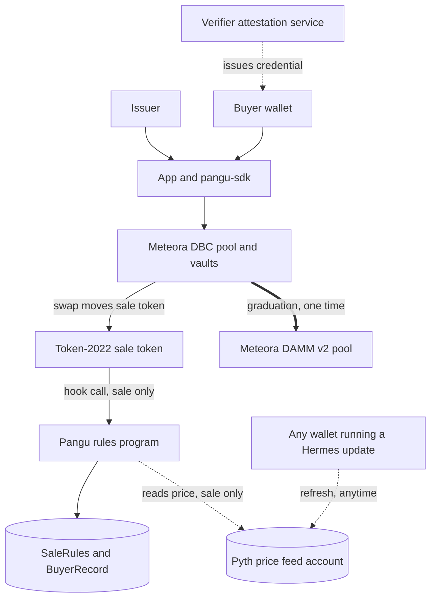
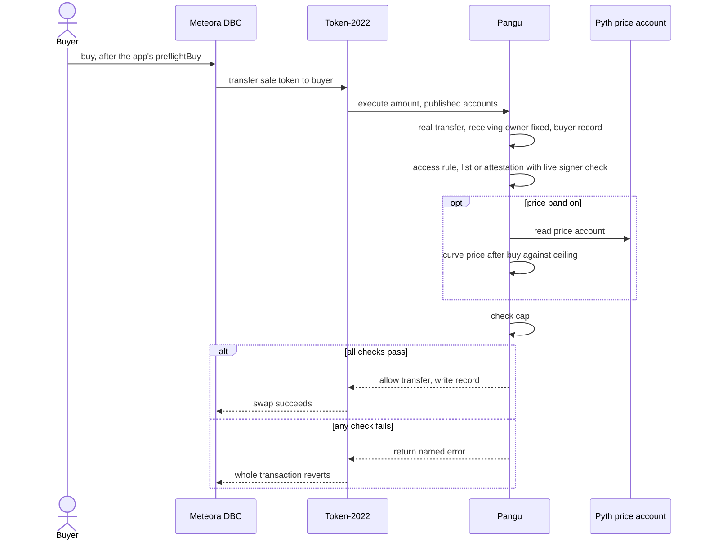
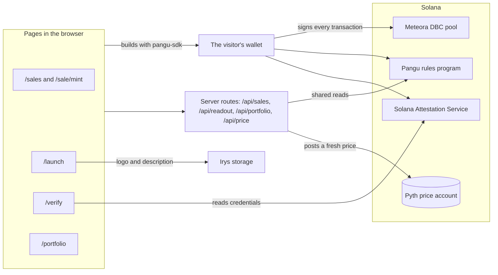

<p align="center">
  
</p>

<h1 align="center">Pangu</h1>

<p align="center">
  <strong>Fair first sales for stock tokens on Meteora's Dynamic Bonding Curve</strong><br>
  <em>பங்கு (Pangu), Tamil for "share": a share of stock, and your fair portion</em>
</p>

<p align="center">
  <a href="https://pangu-web.vercel.app">🚀 Live App</a> •
  <a href="https://youtu.be/dZPinNOR7i0">🎬 Demo Video</a> •
  <a href="https://pangu-web.vercel.app/docs">📚 Documentation</a> •
  <a href="https://www.npmjs.com/package/pangu-sdk">📦 npm</a> •
  <a href="packages/sdk">🧰 SDK</a>
</p>

<p align="center">
  <a href="#features">Features</a> •
  <a href="#architecture">Architecture</a> •
  <a href="#-try-it-in-2-minutes">Try it</a> •
  <a href="#quick-start">Quick Start</a> •
  <a href="#sdk-integration">SDK Integration</a> •
  <a href="#test-results">Test Results</a> •
  <a href="#-security">Security</a>
</p>

---

## Live Deployments

| Platform | URL |
|----------|-----|
| 🚀 **App** | [pangu-web.vercel.app](https://pangu-web.vercel.app) |
| 📚 **Docs** | [pangu-web.vercel.app/docs](https://pangu-web.vercel.app/docs) |
| 🎬 **Demo video** | [youtu.be/dZPinNOR7i0](https://youtu.be/dZPinNOR7i0) |
| 📦 **SDK** | [npmjs.com/package/pangu-sdk](https://www.npmjs.com/package/pangu-sdk) |
| ⛓️ **Devnet program** | [`4Nd46mDiaTSkqXPAXKqT4jkahcz1TxVSdoirbBCAr5qG`](https://explorer.solana.com/address/4Nd46mDiaTSkqXPAXKqT4jkahcz1TxVSdoirbBCAr5qG?cluster=devnet) |
| 🌐 **Mainnet** | Ready, not deployed: [the runbook](docs/deploy/mainnet.md) |

---

## Overview

Pangu runs a stock token's first sale on [Meteora's Dynamic Bonding Curve](https://www.meteora.ag/), where the curve finds the price and no bot or whale can take more than its share. It sits on the token as a Token-2022 transfer hook, the one part of Solana's token program nothing can route around, and checks every buy against a per-wallet cap, an optional approved-buyer list or verifier credential, and an optional ceiling against the real stock's price from Pyth. Selling back to the pool is never blocked. When the curve fills, Meteora removes Pangu from the token for good and it trades freely on DAMM v2; if it never fills, every rule still lifts when the offering period ends.

### Why Pangu?

| | Plain launchpad (DBC, no rules) | Meteora Alpha Vault | Fixed-price presale (Meteora Presale Vault) | Pangu |
|---|---|---|---|---|
| Fair per-wallet cap | ❌ None | ✅ Per-wallet caps | ✅ Capped | ✅ Checked on every buy |
| Price found by a curve | ✅ The curve alone | ❌ One fixed price | ❌ One fixed price | ✅ Live DBC curve |
| Ceiling against the real stock price | ❌ None | ❌ None | ❌ None | ✅ Optional, read from Pyth |
| Approved buyers or credentials | ❌ Anyone buys | ✅ Whitelist | ✅ Allowlist | ✅ Issuer list or verifier credential |
| Selling back always open | ✅ Ordinary DBC selling | ⚠️ Not guaranteed | ⚠️ No curve to sell back into | ✅ Nothing can block it |
| Rules end by themselves | ➖ No rules | ➖ Not built around a curve | ➖ Not built around a curve | ✅ At graduation or the offering end |

Alpha Vault also cannot attach to a bonding curve at all: it sits in front of DLMM and DAMM pools only. The full comparison is in [docs/site/why-not.md](docs/site/why-not.md).

---

## Features

### 🛒 For buyers
- `/sales` lists every Pangu sale on the chain, found by scanning the program itself.
- Each sale page quotes a buy off Meteora's pool and asks the rules first, so your wallet only signs what the chain would take.
- A buy or a sell is refused on chain if it returns less than the page showed, less the 1 percent slippage it states.
- Selling back to the pool is always allowed: no cap, list or price can block an exit.
- `/portfolio` shows every sale a wallet is in, what it holds, and the room left under each cap.

### 🏛️ For issuers
- `/launch` opens a sale from one form in two transactions, for about 0.0193 SOL.
- The form sets the cap, who may buy, an optional ceiling over Apple's exchange price or AAPLx, the offering period, and an optional logo stored on Irys.
- The sale page is the issuer's desk: approve wallets, claim trading fees, and move the curve to DAMM v2 once it fills.
- The program refuses a sale that would hurt its buyers: a ceiling not paid in a listed dollar, a paying token the issuer can freeze, or a cap as large as the whole sale.
- Minting power is gone before the sale opens, so nobody, the issuer included, can mint past the cap.

### 🪪 For verifiers
- `/verify` sets a verifier up on the Solana Attestation Service and issues a credential to each wallet it has checked.
- Revoking a credential closes it, and the wallet's next buy is refused.
- A credential sale checks on every buy that the key that signed the credential is still on the verifier's list.
- Anyone can check a wallet against a verifier on the same page.

### 🛠️ For developers
- `pangu-sdk` has three entry points: a core reader safe in a browser, `pangu-sdk/dbc` to build a sale's transactions, and `pangu-sdk/price` to refresh the price from a server.
- `preflightBuy` tells a buyer what the program would say before anything is signed.
- Each of the program's 33 named errors comes back as a plain sentence a buyer can read.
- The command-line tools (`launch`, `seed`, `prove`, `graduate`, `status`) run a whole sale's life against devnet.

---

## Devnet Deployment

| What | Address | Network |
|------|---------|---------|
| Pangu rules program | `4Nd46mDiaTSkqXPAXKqT4jkahcz1TxVSdoirbBCAr5qG` | Devnet, deploy 7, SBPF v3 |
| PBAND2, demo sale with a ceiling 5% over Apple's exchange price | [`5VrNEfV1...GZSo`](https://explorer.solana.com/address/5VrNEfV1gQrBrMLSxyaK3AXRa2yj9Xp9i65MZzKHGZSo?cluster=devnet) | Devnet |
| PAAPLX, demo sale with a ceiling 5% over AAPLx | [`8FaBUEjM...CQvK`](https://explorer.solana.com/address/8FaBUEjMfkpYAzZLmLKwYHxd15BNC1ZBFkgTgN2WCQvK?cluster=devnet) | Devnet |
| Verified build, sha256 | `16a13b7f8e9eab5f407d9564f8826bdca8390e6a28dc411a954adad7d3d7852e` | Mainnet build, not deployed |

Both demo sales cap each wallet at 10% of what the curve sells, are paid in a devnet demo dollar, and hold their rules until 7 October 2026. PBAND2 takes buys while Pyth publishes Apple's exchange price; PAAPLX is banded on AAPLx, which Pyth publishes all week. Every other sale is on the [addresses page](docs/site/addresses.md), and every deploy is in [docs/deployments.md](docs/deployments.md).

---

## Architecture

### How the pieces fit



### One buy, end to end



### The app and the chain



Only the visitor's wallet signs; no route ever signs for a visitor. More diagrams: [ARCHITECTURE.md](ARCHITECTURE.md) and `/docs/how-it-works` in the app.

---

## 🚀 Try it in 2 minutes

1. Open the Live App link above and connect any devnet wallet: the front page reads the running demo sale straight from devnet.
2. Scroll to "Try to break it", press "Get demo dollars", and run the nine rows: seven attacks come back refused by the program, by name, with a link to each transaction.
3. Open PAAPLX or PBAND2 from `/sales`, buy an amount the page has checked against the rules, then sell some back.
4. Launch your own sale at `/launch` in two transactions for about 0.0193 SOL, with a price ceiling and a logo if you like.
5. Open `/portfolio` with the same wallet to see the sale you bought into, the room left under your cap, and the sale you just issued.

---

## Quick Start

### Prerequisites

- Windows with WSL Ubuntu holding Anchor 1.2.0, Solana CLI 4.2.2, Rust and rsync (the pinned on-chain toolchain does not build natively on Windows)
- Node.js 20+
- A devnet wallet such as Phantom or Solflare, with a little devnet SOL

### Installation

```bash
git clone https://github.com/ramakrishnanhulk20/Pangu.git
cd Pangu

# check the WSL toolchain
MSYS_NO_PATHCONV=1 wsl -d Ubuntu -- bash scripts/wsl/env-check.sh

cd packages/sdk && npm install && npm run build
cd ../scripts && npm install && npm run sdk:refresh
cd ../web && npm install && npm run sdk:refresh
```

### Development

```bash
# the program: 31 Rust tests and 141 bankrun tests
MSYS_NO_PATHCONV=1 wsl -d Ubuntu -- bash scripts/wsl/test.sh

# a whole sale against real Meteora programs on a forked mainnet: 38 steps, about 5 minutes
MSYS_NO_PATHCONV=1 wsl -d Ubuntu -- bash scripts/wsl/fork-test.sh

# the SDK and the devnet scripts: 178 and 126 tests
cd packages/sdk && npm test
cd ../scripts && npm test

# the app: copy .env.example to .env.local first, every value is explained there
cd ../web && npm run dev
```

---

## SDK Integration

Install the SDK to read Pangu sales and build their transactions:

```bash
npm install pangu-sdk @solana/web3.js
```

### Find a sale, check a buy, build it

```ts
import { Connection, PublicKey } from "@solana/web3.js";
import { saleDirectory } from "pangu-sdk";
import { buyTransaction, preflightBuy } from "pangu-sdk/dbc";

const connection = new Connection(process.env.RPC_URL!);
const buyer = new PublicKey("...");

const sales = await saleDirectory(connection);
const sale = sales.find((entry) => entry.symbol === "PAAPLX" && entry.running);
if (!sale) throw new Error("no running PAAPLX sale");

const check = await preflightBuy({ connection, buyer, mint: sale.mint, amountOut: 100_000_000n, openingRecord: true });
if (!check.ok) throw new Error(check.reason ?? "refused");

const buy = await buyTransaction({ connection, buyer, mint: sale.mint, amountIn: 30_000_000n });
console.log(buy.expectedAmountOut, buy.minimumAmountOut, buy.bytes);
```

`amountOut` is the sale tokens the buyer wants and `amountIn` the paying tokens they spend, both in raw units. The SDK never signs or sends: the buyer's wallet signs `buy.transaction`.

📖 **Full SDK reference**: [packages/sdk/README.md](packages/sdk/README.md)

---

## Program Instructions

| Instruction | What it does |
|-------------|--------------|
| `create_sale(cap, access_mode, credential, schema, band, ends_at)` | Stores a sale's rules in the same transaction as its DBC pool, once per token, after checking the pool, its template, the paying token, the cap and the end date |
| `open_buyer_record` | Creates a wallet's own record before its first buy |
| `approve_buyer` | The issuer approves a wallet on a list sale |
| `revoke_buyer` | The issuer withdraws an approval; the wallet can still sell |
| `close_buyer_record` | Returns a record's rent to its wallet after graduation, after the offering ends, or while its net bought is zero |
| `execute` | The transfer hook: Token-2022 calls it on every move of the sale token, and it runs the rules |

The program's 33 errors, each with the sentence a buyer sees, are in [packages/sdk/src/errors.ts](packages/sdk/src/errors.ts); `/docs/security` in the app maps each rule to the refusal that proves it.

---

## Test Results

From [docs/measurements/test-counts.md](docs/measurements/test-counts.md), every suite run fresh on 23 September 2026.

| Suite | Result |
|-------|--------|
| Program, Rust unit tests | 31 passed |
| Program, bankrun suite | 141 passing |
| `pangu-sdk` | 178 passed |
| Devnet scripts | 126 passed |
| Forked mainnet, a whole sale against real Meteora programs | 38 passing |
| Forked mainnet, SDK suite | 16 steps passing |
| Mainnet rehearsal on forked mainnet | `MAINNET-REHEARSAL-OK` |

The latest attack run on the live devnet program, `npm run prove` on PAAPLX:

```
9 attacks run, 8 refused as expected, 1 allowed as expected, 1 not applicable, 0 off the standard
```

That run was on 23 September 2026, before the program moved to SBPF v3 the next day; the v3 bytecode is proven by the two fork suites and the mainnet rehearsal. Every devnet transaction is in [docs/measurements/devnet-run.md](docs/measurements/devnet-run.md).

---

## 🔐 Security

Pangu holds itself to twenty-five written rules, C1 to C25, set out in [the threat model](docs/security/threat-model.md). Every rule the program enforces is proven by a named test, and most also by a transaction refused on Solana devnet. The code has been through code review passes, not an independent audit. The team holds the upgrade key and says so openly; the mainnet plan hands it to a Squads multisig.

---

## 🧾 Proof links

- A buy past the per-wallet cap: [refused on devnet](https://explorer.solana.com/tx/3FqJJi3ocCT13oLaPA7pBchGF9c4LrqVoZFKdfiNxsmMLHDzKdz8ny7G8TrLr6bAcCJwP2Mbcwvikyf2C9Anp5d8?cluster=devnet), `OverCap`
- A buy that would push the curve more than 5% over the stock price: [refused on devnet](https://explorer.solana.com/tx/4LXby4FwaytfNkRtj6TwyMWsm92iZFbyTEG6mvf8iwMxMdbwgKFaczDWMuexBgiqmK58UDFJ6iusQQt51vaEAYRc?cluster=devnet), `PriceOutsideBand`
- Sale tokens sent straight to another wallet during the sale: [refused on devnet](https://explorer.solana.com/tx/n5w2RNRdNzu3TdhaNiRvMMPqjd1vP5qykkNDjVCgDS5Rvgu11Sd1KSJ4zD3MUY1uKgfxLz2TmyHr3dF33ax6hK3?cluster=devnet), `WalletToWalletDuringSale`
- A buy from a wallet with no credential from the sale's verifier: [refused on devnet](https://explorer.solana.com/tx/2dvaB2gcFvwmdmQbYHV2wuuGKtQfTdPUk6yZNWXTMyrFHE9XVkeWZM2N7tGiwysNDx8jHUTrGxMkBFWDK3G3iPGi?cluster=devnet), `CredentialInvalid`
- A price ceiling on a paying token outside the dollar list: [refused on devnet](https://explorer.solana.com/tx/M9GmvWbFTHCPBJnPbX1k2hmHUzqdBgAQnf7LevymftEjcjTbfM6wy3YXrUieCg2NWsfNdoP9qXESgQP4C9wcYCG?cluster=devnet), `BandNeedsDollarQuote`
- A buy that would return less than the page showed, after the market moved: [refused on devnet](https://explorer.solana.com/tx/3CRjWnZY8QnAfRPV5jpWbXtVyYvdjnPVNngxKGncsmvARp8kip9x6yq6iaqP3A34UoY2gv3rzHWJURWnBR82pq7b?cluster=devnet), Meteora's `ExceededSlippage` on the floor the app set

---

## 🌐 Mainnet ready

- Not deployed. The deploy, sales paid in USDC and AAPLx, and the Squads handover were rehearsed on a forked copy of mainnet on 23 September 2026.
- The verified mainnet build: SBPF v3, 337,856 bytes, sha256 `16a13b7f8e9eab5f407d9564f8826bdca8390e6a28dc411a954adad7d3d7852e`, reproducible in the Solana Foundation's pinned build image.
- One guarded command deploys it after checking a typed phrase, the binary, the program keypair, the network and the balance: [docs/deploy/mainnet.md](docs/deploy/mainnet.md).

---

## Project Structure

```
Pangu/
├── packages/
│   ├── program/        # the Anchor program: the rules, bankrun tests, forked-mainnet tests
│   ├── sdk/            # pangu-sdk: read a sale, build its transactions, keep its price fresh
│   ├── scripts/        # devnet commands: launch, seed, prove, graduate, status
│   └── web/            # the Next.js app, its server routes, and /docs
│
├── docs/               # deploy history, measurements, the mainnet runbook, the threat model
├── scripts/wsl/        # build, test and deploy the program from Windows through WSL
└── ARCHITECTURE.md     # accounts, instructions, the hook decision, every diagram
```

---

## Tech Stack

| Layer | Technology |
|-------|------------|
| On-chain program | Rust, Anchor 1.2.0, Solana CLI 4.2.2, SBPF v3 |
| Sale and market | Meteora Dynamic Bonding Curve 0.2.1, DAMM v2, Token-2022 transfer hook |
| Stock price | Pyth, `pyth-solana-receiver-sdk` 2.0.0, `@pythnetwork/pyth-solana-receiver` 0.16.0 |
| Credentials | Solana Attestation Service |
| SDK | TypeScript, tsup, `@meteora-ag/dynamic-bonding-curve-sdk` 1.5.12 |
| Frontend | Next.js 16.3.5, React 19.2.8, Tailwind CSS 4.3.3, Framer Motion, GSAP, Lenis |
| Wallet | Solana wallet adapter, `@solana/wallet-adapter-react` 0.15.40 |
| Storage | Irys, for a launch's logo and description |
| Reproducible build | `solana-verify` 0.5.2 in `solanafoundation/solana-verifiable-build:4.2.2` |
| Upgrade key | Squads v4 multisig, `@sqds/multisig` 2.1.4 in the rehearsal |
| Docs | Fumadocs 16.15.13, Mermaid 12.0.0 |

---

## License

MIT License, see [LICENSE](LICENSE) for details.

---

## Acknowledgments

- [Meteora](https://www.meteora.ag/): the Dynamic Bonding Curve, its transfer-hook pools, and DAMM v2
- [Pyth](https://www.pyth.network/): the stock prices behind the price ceiling
- [Solana Attestation Service](https://attest.solana.com/): the verifier credentials
- [Irys](https://irys.xyz/): storage for a launch's logo and description
- [Squads](https://squads.so/): the multisig planned to hold the upgrade key

---

<p align="center">
  Built with ⚖️ by <a href="https://github.com/ramakrishnanhulk20">Ram</a>
</p>
