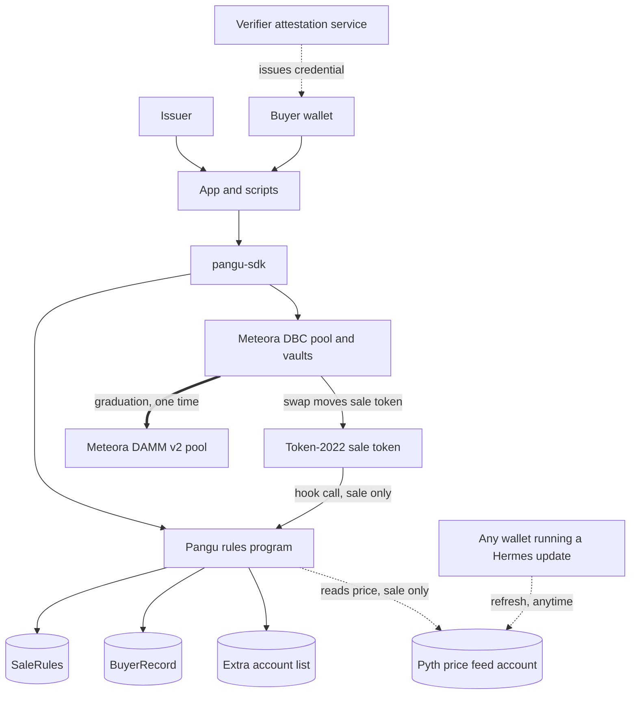
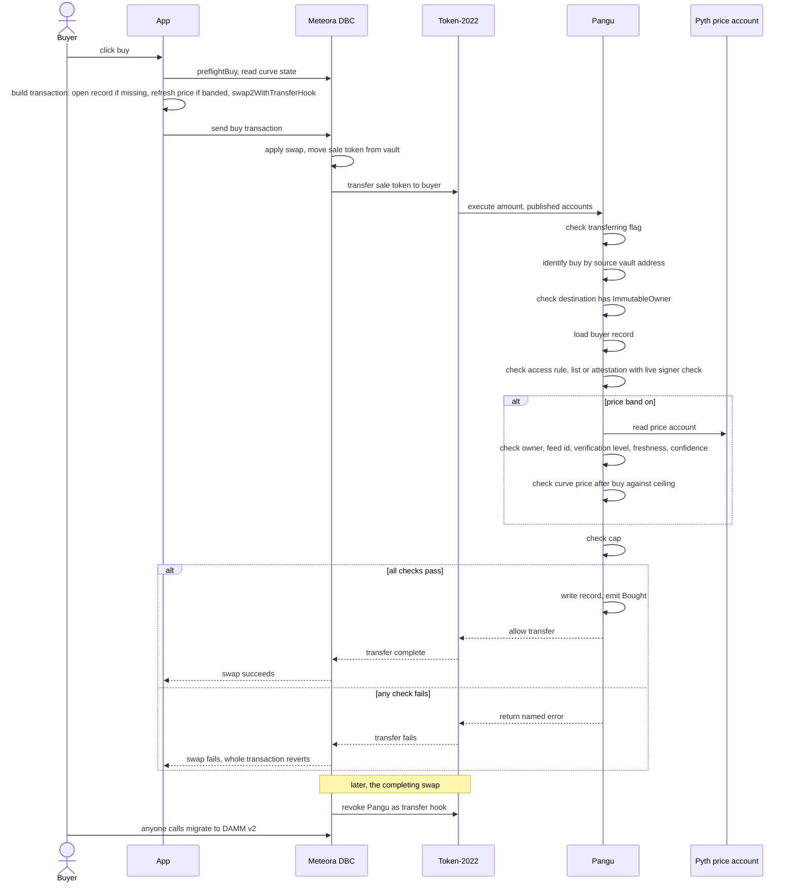
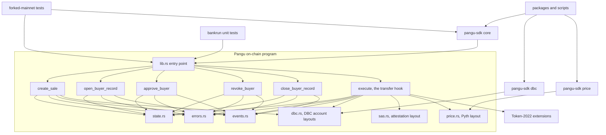
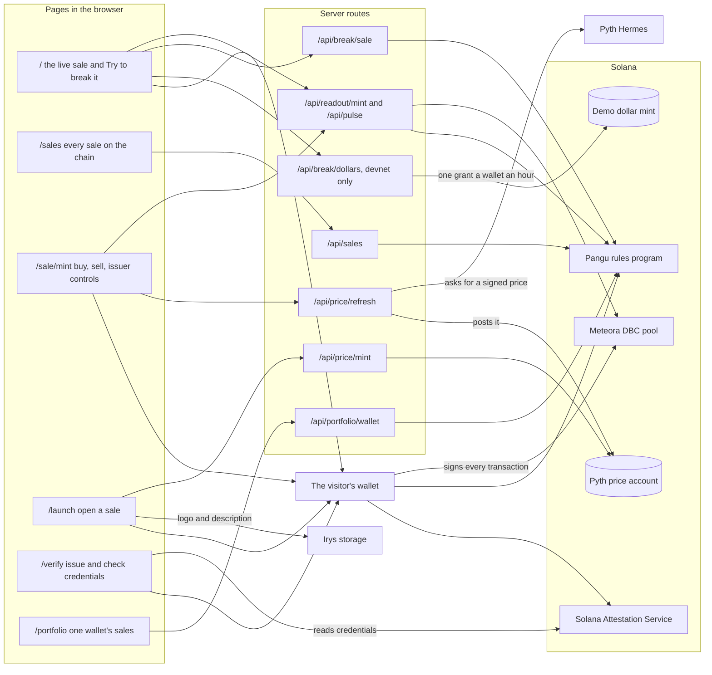

# Pangu

Pangu is Tamil for share: a share of stock, and your fair portion.

We help stock token issuers run a fair first sale on Meteora's Dynamic Bonding Curve, where the curve finds the price and no bot or whale can take more than their share.

Live app: coming with the Vercel deploy, the team fills in the URL · Docs: `/docs` inside the app, source in [`docs/site`](docs/site) · Devnet program: [explorer](https://explorer.solana.com/address/4Nd46mDiaTSkqXPAXKqT4jkahcz1TxVSdoirbBCAr5qG?cluster=devnet) · SDK: [`packages/sdk`](packages/sdk) · Mainnet runbook: [`docs/deploy/mainnet.md`](docs/deploy/mainnet.md)

## Live deployments

| Network | Program id | Deployed | Upgrade authority | Build |
| --- | --- | --- | --- | --- |
| Devnet | `4Nd46mDiaTSkqXPAXKqT4jkahcz1TxVSdoirbBCAr5qG` | The sixth deploy, slot 502981972, 23 September 2026 at 14:08:42 UTC | `Fwi8ejZ8kqF8PwcxssHFqJQZmVrkmBfoaXV5CTjqp5L`, held by the team, stated openly | sha256 `e40ab680c3ff8a806e51b66b014765674b95ccbd6ead553729689ab20c4cb59f`, 363,800 bytes |
| Mainnet | Ready, not deployed. The same address, fixed by the program keypair | One guarded command the team runs with its own key | The team at launch, then a two of three Squads v4 multisig | The verified mainnet build: its sha256 and the command that reproduces it are in [`docs/deployments.md`](docs/deployments.md) |

The devnet program was deployed once and upgraded five times, always at this same address, each build checked byte for byte against the code that was tested before it went live. The fifth deploy is the rules v2 build: the paying token is stored and checked, a banded sale must be priced in dollars, the cap stays below what the curve sells, and every sale carries an offering period. The sixth narrows the dollars a price ceiling accepts to a list per network: devnet USDC and the demo dollar on the devnet build, USDC alone on the mainnet build. Full history: `docs/deployments.md`.

Mainnet is ready and not deployed. The mainnet build is made reproducibly in the Solana Foundation's pinned build image and verified; the deploy script checks a typed phrase, the binary's hash, the program keypair, the network's genesis hash and the deployer's balance before it sends anything; and on 23 September 2026 the deploy, sales paid in USDC and in AAPLx, the upgrade key's handover to a Squads multisig, and the web app built for mainnet all ran on a forked copy of mainnet (`docs/measurements/mainnet-rehearsal.md`, `packages/web/lab-evidence/network-fork.txt`).

## Overview

A stock token's first sale is the moment that decides who ends up holding it. Meteora's Dynamic Bonding Curve already solves half of that problem: it finds a fair price by letting buyers push it up as they buy, instead of an issuer picking a number in advance. Pangu solves the other half. It sits on the token as a transfer hook, the one piece of Solana's token program that nothing can route around, and it enforces a per-wallet cap, an optional approved-buyer gate, and an optional ceiling against the real stock's market price. When the curve fills, Meteora removes Pangu from the token for good, and it trades freely from then on.

Every sale also names an offering period when it opens. Once it ends, every rule lifts even if the curve never filled, so a slow sale cannot hold its buyers forever. An issuer who wants the rules to last until graduation has to say so and open the sale with no end date. Before a sale can open at all, the program checks the three things an issuer could get wrong: a sale with a price ceiling must be paid in a dollar the program lists, the issuer cannot pick a paying token they are able to freeze, and the per-wallet cap must sit below what the curve sells.

The app is the whole product, and it has four doors. An issuer opens a sale from one form at `/launch`. A buyer finds any sale on the chain at `/sales`, asks the rules on its page what they would say, buys and sells back. A verifier issues and revokes the credentials a sale can require at `/verify`. Anyone sees one wallet's place in every sale at `/portfolio`. The front page shows the live demo sale and lets anyone attack its rules from their own wallet.

Pangu is for two kinds of teams: anyone issuing a new stock token who wants its first sale to reach real buyers instead of the fastest bot, and a stock-paired launchpad, the kind of app Meteora itself announced this quarter, that needs the same fairness rules for every token it lists.

An issuer already has other ways to run a first sale. Here is how Pangu compares, from `docs/site/why-not.md`. A blank cell means the source does not state that fact for that alternative.

| | Price discovery | Per-wallet cap | Approved buyers | Rules switch off at graduation | Selling always allowed |
| --- | --- | --- | --- | --- | --- |
| Pangu | Yes, inside a live DBC curve | Yes | Optional: issuer list or a verifier credential | Yes, automatic and permanent, done by Meteora in the completing trade | Yes, guaranteed: nothing can block a sell to the pool |
| A plain DBC launchpad, no rules program | Yes, the curve alone | No | No | Not applicable, there are no rules to switch off | Yes, ordinary DBC selling |
| Meteora Alpha Vault | No: sells at one fixed price, and cannot attach to a bonding curve at all | | | Not applicable, it is not built around an ongoing curve | |
| Meteora Presale Vault | No: a standalone sale before any market exists, fixed price, first come, or pro rata | Capped and allowlisted | Yes | Not applicable, it is not built around an ongoing curve | Not guaranteed, there is no ongoing curve to sell back into |
| A fixed-price sale | No: throws away the one thing a bonding curve is good at | | | Not applicable | |

## Features

**For buyers**
- `/sales` lists every Pangu sale on the chain, found by scanning the program itself, so a sale opened a minute ago is already there.
- Each sale's page quotes a buy or a sell off Meteora's pool and asks the rules first: a pass, or the program's own refusal with what to do about it, such as the room left under the cap, the issuer or verifier to ask, or a price too far over the ceiling. Your wallet is only asked to sign what the chain would take.
- Selling back to the pool is always allowed. Nothing, not the cap, not the approval list, not the price, can ever block an exit.
- The optional price ceiling never blocks a buy at or below the real stock's price, only one that would push the curve above it.
- `/portfolio` shows every sale a wallet is in, what it holds and what that is worth at the curve's price, and the room left under each cap.

**For issuers**
- `/launch` opens a sale from one form: the token's name and symbol, the shares, what buyers pay in, the raise target, the share kept for the trading pool, the cap on one wallet, who may buy, an optional price ceiling on Apple's exchange price or on AAPLx, the offering period, and an optional logo, description and links stored through Irys. The curve redraws as you type, and two transactions later the sale is live, for about 0.0193 SOL.
- A launch that stops halfway picks up where it stopped: the template already on chain is reused, and only the second transaction is sent.
- The sale's page is the issuer's desk: approve wallets on a list sale, claim the trading fees, and move the curve to DAMM v2 once it fills.
- The program refuses a sale set up in a way that would hurt its buyers: a price ceiling on a sale not paid in a listed dollar, since the ceiling compares dollars with dollars; a paying token the issuer can freeze, since freezing it would stop sellers being paid; and a cap as large as the whole sale, since one wallet could then buy everything.
- The minting power on the sale token is revoked automatically before the sale can open, so nobody, including the issuer, can mint past the cap once it is live.
- The rules disappear on their own at graduation, or when the offering period ends. There is no separate step and no way to leave them on by accident.
- The same rules program covers a dollar-priced sale and a stock-paired one, so a launchpad like Meteora's own StockLaunch is a second kind of customer, not only a single issuer. On mainnet the launch page offers USDC and the tokenized stocks AAPLx, TSLAx, NVDAx and SPYx as paying tokens.

**For verifiers**
- `/verify` sets a verifier up on the Solana Attestation Service, issues a credential to each wallet it has checked, lists them, and revokes one by closing it. Anyone can check a wallet against a verifier there.
- A sale in credential mode reads the credential on every buy, and checks the key that signed it is still on the verifier's list at that moment, so removing a signer stops its old approvals at once.
- Credential mode is built to carry a fee-sharing arrangement as a next step, so a verifier has a reason to keep approving buyers after this hackathon ends.

**For developers, through the SDK**
- `pangu-sdk` has three entry points: a core reader safe in a browser, `/dbc` for building and sending a sale's transactions, and `/price` for a server route that refreshes the oracle. The app is built on it.
- Every one of the program's 33 named errors comes back as a plain sentence a buyer can read, not an error code.
- The command-line tools (`launch`, `seed`, `prove`, `graduate`, `refresh-price`, `mint-dollars`, `status`) run a whole sale's life against the live devnet program and print every number back off the chain.

## Devnet deployment

The sales below are live on the program above (`docs/measurements/devnet-run.md`). The front page leads with the banded demo sale that can take a buy right now: PBAND2 while Pyth is publishing Apple's exchange price, and PAAPLX, banded on AAPLx which trades all week, when it is not. PBAND and the list sale were opened under version 1 rules, which the current build still reads: they have no offering period and read as never ending.

| Sale | Mode | Mint | Key facts | Explorer |
| --- | --- | --- | --- | --- |
| Demo sale, banded on Apple's exchange price (PBAND2) | Open access, 10% per-wallet cap, 5% price ceiling over Apple's exchange price, paid in the demo dollar, offering period ends 7 October 2026 at 10:38 UTC | `5VrNEfV1gQrBrMLSxyaK3AXRa2yj9Xp9i65MZzKHGZSo` | Sixth run. 20 shares, opened at 275.95 dollars a share with Apple at 340.15. 10 holders, 56.63% of the curve sold, largest holder 16.93% of everything sold against a cap worth 17.66%. 9 attacks run, 8 refused as expected, 1 allowed as expected: the cap and the ceiling both refused on the same sale | [mint](https://explorer.solana.com/address/5VrNEfV1gQrBrMLSxyaK3AXRa2yj9Xp9i65MZzKHGZSo?cluster=devnet) · [a buy refused at the ceiling](https://explorer.solana.com/tx/4LXby4FwaytfNkRtj6TwyMWsm92iZFbyTEG6mvf8iwMxMdbwgKFaczDWMuexBgiqmK58UDFJ6iusQQt51vaEAYRc?cluster=devnet) |
| Demo sale, banded on AAPLx around the clock (PAAPLX) | Open access, 10% per-wallet cap, 5% price ceiling over AAPLx, paid in the demo dollar, offering period ends 7 October 2026 at 13:05 UTC | `8FaBUEjMfkpYAzZLmLKwYHxd15BNC1ZBFkgTgN2WCQvK` | Seventh run. PBAND2's curve to the digit, banded on the tokenized Apple share Pyth publishes all week, so a buy can land at any hour. 10 holders, 57.26% of the curve sold, largest holder 16.75% of everything sold against a cap worth 17.46%. 9 attacks run, 8 refused as expected, 1 allowed as expected | [mint](https://explorer.solana.com/address/8FaBUEjMfkpYAzZLmLKwYHxd15BNC1ZBFkgTgN2WCQvK?cluster=devnet) · [a buy refused at the ceiling](https://explorer.solana.com/tx/5TbBnGrVHCkEj2GkdpRR7cR5p5TMUFrwubhqub5GVYQrTK3QsSTmhoLGYTZ1fEQ5diUm4C6M6acVAu6aUNTUGm8v?cluster=devnet) |
| Credential sale (PVRFD) | Verifier credential, 10% per-wallet cap, priced in SOL, no ceiling, no end date | `7ixMAMUmysN4qsCpthdznhq7aRbiCNB5Xeg3X9vBSLWn` | Credential mode proven on the live program: a wallet with no attestation refused with `CredentialInvalid`, an attested wallet bought under the cap, and the cap still held it. 10 attacks run, 8 refused as expected, 2 allowed as expected. Only the attacking wallets hold it, so the largest holder's 35.80% of what has sold, against a cap worth 47.55%, is a share of a thin sale | [mint](https://explorer.solana.com/address/7ixMAMUmysN4qsCpthdznhq7aRbiCNB5Xeg3X9vBSLWn?cluster=devnet) · [a buy with no attestation, refused](https://explorer.solana.com/tx/2dvaB2gcFvwmdmQbYHV2wuuGKtQfTdPUk6yZNWXTMyrFHE9XVkeWZM2N7tGiwysNDx8jHUTrGxMkBFWDK3G3iPGi?cluster=devnet) |
| Earlier demo sale (PBAND) | Open access, 10% per-wallet cap, 5% price ceiling over Apple's exchange price, version 1 rules with no offering period | `2dp5caL9PPVWafYkmNHBdHEX6zWfG42BmERcnLK75N4Y` | Fifth run. 20 shares, opened at 275.21 dollars a share with Apple at 342.45. After that run's attacks: 14 holders, 63.18% of the curve sold, largest holder 15.18% of everything sold against a cap worth 15.83%. 9 attacks run, 8 refused as expected, 1 allowed as expected | [mint](https://explorer.solana.com/address/2dp5caL9PPVWafYkmNHBdHEX6zWfG42BmERcnLK75N4Y?cluster=devnet) · [a buy refused at the ceiling](https://explorer.solana.com/tx/3FMhcSoCkFCp3PBMBjaejwEiXVmdDAREJCDaP2bYw2u2hGxanesdx5vi2cEU2ZMK1obRZhcUgWFKQ1tqMUy8sXDU?cluster=devnet) |
| List-mode sale (PLIST) | Issuer-managed list, 10% per-wallet cap | `2ARD1KwvxyjLPwe46rivjxPRyMzvxSEPGvwKTqcNXpFR` | Fourth run. 15 buyers seeded and attacked, 9 attacks run, 8 refused as expected, 1 allowed as expected. Graduated: largest wallet held 16.76% of 467,347,859,706,336 raw units sold against a cap worth 17.12% of them. Migrated to Meteora DAMM v2 pool `2cEAoE9zi53y736DsaPBzgfdrUqJnVgqwutZTGsmsSLc` | [mint](https://explorer.solana.com/address/2ARD1KwvxyjLPwe46rivjxPRyMzvxSEPGvwKTqcNXpFR?cluster=devnet) · [migration tx](https://explorer.solana.com/tx/5CpV8KReoYeRqXzeLDvfxuGM2yp99Mex6bTKRjutccd9HcmzZ2b1X36fVsPeuVHb7sQA3PuCkLRE8RJHbogiEPVT?cluster=devnet) |

Six more sales were opened from the launch page by throwaway issuer wallets, to prove it: PLAUNCH twice, PLAUNCHL twice and PLOGO twice. Every one is listed with its terms on the addresses page of the docs, and each run is in `packages/web/lab-evidence`.

The eighth run tried a price ceiling on a fresh six-decimal token that looks like a dollar and is not on the list. The program refused it with [`BandNeedsDollarQuote`](https://explorer.solana.com/tx/M9GmvWbFTHCPBJnPbX1k2hmHUzqdBgAQnf7LevymftEjcjTbfM6wy3YXrUieCg2NWsfNdoP9qXESgQP4C9wcYCG?cluster=devnet), and no sale was opened.

Retired, and no longer checked by `npm run status`: POPEN (`CBckMjBpHHQtcqxbTu5dUd3nQjyV8oVA4nfBZiTwYXo7`), opened deliberately at 400 dollars a share while Apple traded at 343.44 so that [every buy was refused at the ceiling](https://explorer.solana.com/tx/WdP9LtJJuHLmuVbmfEoYiuXpUFV9LB61TCJ4aXKsaV68ToXirizWjfMKRborVun7E2G7GmUA93wkPsfLRpBM5pq?cluster=devnet), and a second list sale (`4kzCbpEZxyzwXno1ZVnTJ9BAGSjD1HVgSBSwikEsxeaE`) opened to prove changed `prove` code, both retired on 23 September 2026. Four sales opened on older builds were retired after the layout-version build: the reader refuses to decode an account written by another layout rather than guess at it, which is exactly the point of the layout-version check.

How the price ceiling itself is derived, refreshed, and checked against Pyth's guardian signatures is written up in full in `docs/measurements/sdk-pyth.md`.

## Diagrams

### 1. How the pieces fit together



### 2. Main sequence: one buy end to end



### 3. Module dependency graph



### 4. The app, its server routes, and the chain



The pages build every transaction in the browser with `pangu-sdk`, and only the visitor's wallet signs them. The server routes read the chain for everyone at once and share each reading for a few seconds, and they hold what a browser must never see: the keyed network endpoint, the Pyth key, and one signing key that pays for price refreshes and, on devnet only, mints demo dollars (threat model C15 and C17).

## The two-minute judge path

Everything below is in the browser, on Solana devnet, reading the live program. The terminal is optional and comes last.

1. The front page. Open the live app (link above once deployed). The poster hero reads the running sale straight from devnet. "Watch the sale" scrolls to the readout: the sale's real bonding curve drawn from Meteora's config, the price now against the stock's live price and the ceiling, the raise against its graduation threshold, every buyer with its share against the cap. A switch shows the graduated sale and its DAMM v2 pool. Then "How it works": the five rules, one drawing each, pinned while you read.
2. Try to break it. Connect any devnet wallet; if it holds no devnet SOL, the faucet link on that screen gives some. Press "Get demo dollars": the sale is priced in a demo dollar token, and that button mints your wallet enough of it for every row, from a devnet key that holds nothing of value, once an hour. Run the nine rows in order. The first is an honest buy under the cap, which goes through. Rows two to eight are the attacks: over the cap in one go, over it on a second buy, through a second token account, into an account whose owner can change, straight to another wallet, a direct call with no transfer, and a buy above the price ceiling. Each comes back refused by the program, named, with a link to the transaction. The last row sells back to the pool and goes through. "Simulate" is the default, so your wallet never signs something meant to fail; "Send for real" makes every refusal a real failed transaction on the explorer.
3. Open a sale page and buy. Go to `/sales`, the directory the program itself holds, and open PBAND2 or PAAPLX. Type an amount: the page quotes it off Meteora's pool and shows the rules' answer before your wallet is asked. Buy, watch your standing change, then sell some back.
4. Launch your own sale. Open `/launch`. Name a token, keep the demo dollar, turn the ceiling on over AAPLx, pick 14 days, drop a logo if you like. The curve redraws as you type. Two transactions, about 0.0193 SOL, and the sale is on `/sales`.
5. The portfolio. Open `/portfolio` with the same wallet: the sale you bought into, what it is worth and the room under your cap, and the sale you just issued.
6. The rubric. `/docs` has the rubric page: every bounty line and every invariant mapped to the page, the file, the test and the transaction that proves it.

The same attacks from a terminal, against the same live program:

```bash
cd packages/scripts && npm run prove
```

Last lines, from the sixth devnet run against the banded dollar sale (PBAND2), the sale `prove` runs on when no mint is named:

```
proof    : the largest wallet holds 16.93 percent of the 6229218448 raw units sold, against a cap worth 17.66 percent of them
cost     : 0.011317 SOL, after 0.033344 SOL came back from the attacking wallets

9 attacks run, 8 refused as expected, 1 allowed as expected, 1 not applicable, 0 off the standard
```

The same command on the credential sale (PVRFD), `npm run prove -- --mint 7ixMAMUmysN4qsCpthdznhq7aRbiCNB5Xeg3X9vBSLWn`, in the same run:

```
proof    : the largest wallet holds 35.80 percent of the 168233737622413 raw units sold, against a cap worth 47.55 percent of them
cost     : 0.017973 SOL, after 0.077115 SOL came back from the attacking wallets

10 attacks run, 8 refused as expected, 2 allowed as expected, 1 not applicable, 0 off the standard
```

The row not applicable on PBAND2 is the approved-list attack, since that sale is open to anyone; on PVRFD it is the ceiling attack, since that sale has no price band. Only the attacking wallets hold PVRFD, so one capped wallet is a large share of the little that has sold. On PAAPLX, in the seventh run, the same command ended `9 attacks run, 8 refused as expected, 1 allowed as expected, 1 not applicable, 0 off the standard`.

And whether the whole demo is still alive:

```bash
npm run status
```

Last line, from the end of the seventh run:

```
17 passed, 0 warned, 0 failed, 2 not checked, at 2026-09-23T13:12:43Z
```

## Quick start

Everything on-chain runs inside WSL Ubuntu, because the Solana and Anchor toolchains this project pins do not build natively on Windows.

```bash
git clone https://github.com/ramakrishnanhulk20/Pangu.git
cd Pangu

# check the WSL toolchain: Anchor, Solana CLI, Rust, Node, rsync
MSYS_NO_PATHCONV=1 wsl -d Ubuntu -- bash scripts/wsl/env-check.sh

# build and test the on-chain program: 31 Rust tests, 137 litesvm tests
MSYS_NO_PATHCONV=1 wsl -d Ubuntu -- bash scripts/wsl/test.sh

# run a full sale against a forked mainnet validator holding real Meteora and
# Solana Attestation Service programs: 37 steps, takes about 4 minutes
MSYS_NO_PATHCONV=1 wsl -d Ubuntu -- bash scripts/wsl/fork-test.sh

# build the mainnet binary twice in the pinned image and check both hash the same,
# then rehearse the deploy, the sales and the multisig on a forked mainnet
MSYS_NO_PATHCONV=1 wsl -d Ubuntu -- bash scripts/wsl/verify-build.sh
MSYS_NO_PATHCONV=1 wsl -d Ubuntu -- bash scripts/wsl/mainnet-rehearsal.sh <the sha256 verify-build.sh printed>

# build the SDK
cd packages/sdk && npm install && npm run build

# run the web app: copy .env.example to .env.local first, every value is explained there
cd ../web && npm install && npm run sdk:refresh && npm run dev
```

## SDK integration

Two examples, from `packages/sdk/README.md`.

Read a sale's current state:

```ts
import { Connection, PublicKey } from "@solana/web3.js";
import { getSale, listBuyerRecords, saleStanding } from "pangu-sdk";

const connection = new Connection(process.env.RPC_URL!);
const mint = new PublicKey("...");

const sale = await getSale(connection, mint);
if (sale !== null) {
  const standing = saleStanding(sale, await listBuyerRecords(connection, mint));
  console.log(sale.cap, standing.buyers, standing.largestShare);
}
```

Build the instruction to open a sale, with an optional price ceiling:

```ts
import { createSaleInstruction, ACCESS_MODE } from "pangu-sdk";

const instruction = createSaleInstruction({
  issuer: wallet.publicKey,
  pool,
  mint,
  cap: 100_000_000n,
  accessMode: ACCESS_MODE.issuerList,
});
```

The core package never touches Meteora's own SDK, a wallet, or the browser's DOM. `pangu-sdk/dbc` runs a sale on Meteora's curve, the way the launch and sale pages do, and `pangu-sdk/price` keeps the price fresh from a server route. Full detail: `packages/sdk/README.md`.

## Program instructions

From `ARCHITECTURE.md`.

| Instruction | Who calls it | What it does |
| --- | --- | --- |
| `create_sale(cap, access_mode, credential, schema, band, ends_at)` | The pool creator, after the pool exists, in the same transaction | Checks the pool is a genuine DBC hook pool the caller created, checks fees are collected in the paying token, checks the sale token's minting power is already gone. Checks the paying token is the one the launch template names and that the issuer cannot freeze it, and on a banded sale that it is a dollar on this build's list, then stores it. Refuses a cap at or above what the curve sells, and an `ends_at` that is neither zero (no end) nor later than the chain clock. Stores the rules, creates the extra-accounts list. Runs once per mint. |
| `open_buyer_record` | Any wallet, for itself | Creates the wallet's own record, not approved, zero bought. Safe to call twice. |
| `approve_buyer` | Issuer | Issuer-list mode. Creates the record if missing and marks it approved. Never resets tokens bought. |
| `revoke_buyer` | Issuer | Issuer-list mode. Marks the record not approved. The wallet can still sell. |
| `close_buyer_record` | The wallet | After graduation, after the offering period has ended, or any time the record's net bought is zero. Returns the rent to the wallet. |
| `execute` | Token-2022 only | The transfer hook. Runs the four rules on every buy, sell, and wallet-to-wallet move of the sale token. Once the offering period has ended it lets every transfer through untouched, as after graduation. |

## Errors

Every refusal the program can return, in the plain sentence `pangu-sdk` shows a buyer (`packages/sdk/src/errors.ts`).

| Error | What it means |
| --- | --- |
| `NotTransferring` | This token only moves through a real transfer, and this was not one. |
| `ReceivingAccountOwnerCanChange` | The account you are buying into could be handed to someone else later, so the sale will not send tokens to it. Use the wallet's ordinary holding account for this token, the one your wallet app makes by itself. |
| `WrongMint` | That account belongs to a different token than this sale. |
| `WrongBuyerRecord` | The buyer record sent with this transfer belongs to another wallet. |
| `BuyerRecordMissing` | This wallet has no record in the sale yet. Open one first, then buy. |
| `NotApproved` | The issuer has not approved this wallet to buy in this sale. |
| `CredentialInvalid` | This wallet does not carry a valid approval from the verifier this sale trusts. |
| `CredentialExpired` | The verifier's approval for this wallet has run out. |
| `CredentialSignerNotAuthorized` | The key that signed this wallet's approval is no longer allowed to sign for that verifier. |
| `OverCap` | This purchase would take your wallet past the limit for this sale. |
| `WalletToWalletDuringSale` | This token cannot be sent from one wallet to another while the sale is running. |
| `PriceStale` | The stock price this sale checks against is too old to use. Refresh it and try again. Outside market hours there is no fresh price to get, so the sale stays shut until the market opens. |
| `PriceOutsideBand` | This purchase would push the price too far above the real stock price. |
| `WrongPriceAccount` | The price account sent with this transfer is not the one this sale names. |
| `PriceNotFullyVerified` | The price update has not been signed by two thirds of Pyth's guardians, and this sale will not price against a half signed number. |
| `PriceTooUncertain` | Pyth's own publishers disagree about this stock's price by more than this sale allows, so there is no ceiling worth measuring against right now. |
| `NotPoolCreator` | Only the wallet that created the pool can open its sale. |
| `NotAHookPool` | That account is not a Meteora bonding curve pool of the kind Pangu works with. |
| `HookProgramMismatch` | This token does not name Pangu as its transfer hook, so Pangu cannot hold its rules. |
| `MintAuthorityStillSet` | This token can still be minted, so Pangu will not open a sale on it. Launch it with the minting power revoked. |
| `WrongLaunchTemplate` | That launch template is not the one this pool was opened on. |
| `FeesNotInQuoteToken` | This sale's template collects fees in the sale token, and Pangu only accepts templates that collect them in the paying token. |
| `ZeroCap` | A sale needs a per-wallet limit above zero. |
| `InvalidAccessMode` | That access mode does not exist, or the settings do not match the mode chosen. |
| `InvalidBand` | The price band settings are incomplete or out of range. |
| `SaleStillRunning` | The sale is still running and this record still counts tokens, so it cannot be closed yet. Sell them back or wait for the sale to finish. |
| `NotIssuer` | Only the issuer of this sale can do that. |
| `MathOverflow` | The sale's counters cannot go any higher. |
| `WrongLayoutVersion` | These sale rules were written by an older build of the program, so this build will not act on them. |
| `BandNeedsDollarQuote` | A price ceiling needs buyers to pay in a dollar token the program recognises (USDC, or on devnet the demo dollar). Turn the ceiling off, or pick a dollar paying token. |
| `IssuerControlsPayingToken` | You hold the freeze authority of the token buyers pay in, which would let you stop sellers being paid. Pick a paying token whose freeze authority is not yours. |
| `CapCoversWholeSale` | The per-wallet limit is as large as everything the curve sells, so one wallet could buy the whole sale. Set a limit below the curve's supply. |
| `EndInThePast` | The end of the offering period has to be later than now. Pick a future time, or leave it at zero for no end. |

## Test output

The counts recorded in `docs/measurements/test-counts.md`:

```
31 Rust tests
137 litesvm tests, including 6,000 randomised buy, sell, transfer, approve and
  revoke operations across ten sequences, checked against the chain after
  every single one
37 steps against a forked mainnet validator running real Meteora Dynamic
  Bonding Curve, DAMM v2 and Solana Attestation Service programs
146 pangu-sdk unit tests
109 devnet-script tests
```

The 37 steps are the program's own fork suite. The SDK has a fork suite of its own on the same forked validator: 15 steps on the rules v2 interface, and 16 once a step was added that proves a ceiling refused on a token outside the dollar list (`docs/measurements/sdk-fork-test.md`).

The app's four doors each have a recorded run on devnet, a script that drives the real page with a throwaway wallet and checks every line against the chain, in `packages/web/lab-evidence`:

```
launch-devnet.txt     two launches from /launch, every term read back from devnet equal to the form
metadata-devnet.txt   a launch with a logo: stored on Irys, read back through the mint byte for byte
sale-devnet.txt       dollars landed, buy landed, sell landed, approval landed, list buy landed
verify-devnet.txt     9 passed, 0 failed
portfolio-devnet.txt  every check passed
network-fork.txt      the mainnet build of the app on forked mainnet: every check passed
```

And the mainnet rehearsal, `docs/measurements/mainnet-rehearsal.md`: `VERIFY-BUILD-OK`, then `DEPLOY-MAINNET-OK` with `HASH MATCH: YES`, `SQUADS-UPGRADE-OK` and `MAINNET-REHEARSAL-OK`.

Earlier runs recorded in `docs/measurements/`, superseded by the counts above as later work added tests: `price-band-pyth.md` (21 September 2026: 27 Rust, 119 litesvm, 36 fork), `sdk-pyth.md` (113 sdk, 24 script), `random-sequences.md` (the 6,000-operation run itself, in full: seeds, the operation mix, and what is checked after every step).

Prove-it command against the live network, run again for this submission:

```bash
cd packages/scripts && npm run prove
```

From the sixth devnet run, against the banded dollar sale (PBAND2):

```
proof    : the largest wallet holds 16.93 percent of the 6229218448 raw units sold, against a cap worth 17.66 percent of them
cost     : 0.011317 SOL, after 0.033344 SOL came back from the attacking wallets

9 attacks run, 8 refused as expected, 1 allowed as expected, 1 not applicable, 0 off the standard
```

Read off the chain right after that run, the largest of the sale's 10 holders had 16.93 percent of everything sold, against a cap worth 17.66 percent of it. The credential sale's lines are in the judge path above.

## Costs, in plain English

| What | Who pays | Cost | Source |
| --- | --- | --- | --- |
| Opening a sale from the launch page | the issuer | about 0.0193 SOL, most of it rent for the new accounts: 0.019294 SOL measured | `packages/web/lab-evidence/launch-devnet.txt` |
| Storing a logo and description | the issuer | 0.000077 SOL, quoted by Irys on devnet | `metadata-devnet.txt` |
| A buy | the buyer | Solana's 5,000-lamport fee; 113,832 to 163,084 compute units on forked mainnet, depending on the sale and the point on the curve | `docs/measurements/mainnet-rehearsal.md` |
| A sell | the seller | 5,000 lamports; 83,540 to 99,526 compute units, cheaper than a buy because the sell path never reads a price | `mainnet-rehearsal.md` |
| Setting up as a verifier, issuing a credential and revoking it | the verifier | 0.002519440 SOL in all: the credential's and schema's deposits, which stay, and the fees; a revoked credential's deposit comes back | `verify-devnet.txt` |
| Refreshing the Pyth price | whoever refreshes, the app's own key by default | 35,180 lamports for two transactions and two guardian-signed messages, no rent left behind | `docs/measurements/sdk-pyth.md` |
| The mainnet deploy | the team | almost all rent that stays locked in the program's account for as long as the program exists; the exact figures, from mainnet's own rent, are in the runbook | `docs/deploy/mainnet.md` |

The compute figures are from the build rehearsed on 23 September 2026; a later build records its own beside them in `docs/measurements/fork-test.md`.

## Project structure

| Path | What is in it |
| --- | --- |
| `packages/program` | The Anchor program in `programs/pangu`: the four rules and the account layouts. `tests` holds the litesvm suite, `fork-tests` the suite against real Meteora and Solana Attestation Service programs cloned from mainnet, and `feeds` the real account bytes both read. |
| `packages/sdk` | `pangu-sdk`: reads a sale, builds its instructions, runs it against Meteora's DBC, and keeps its Pyth price fresh. `test` holds its unit tests, and `fork-test` its own fork suite plus the mainnet rehearsal of the sales and the Squads handover. |
| `packages/scripts` | The devnet commands: `launch`, `seed`, `prove`, `graduate`, `refresh-price`, `mint-dollars`, `status`, with their tests, and `sales.json`, the list of demo sales the scripts opened. |
| `packages/web` | The Next.js app. `app` holds the pages (`/`, `/sales`, `/sale/[mint]`, `/launch`, `/verify`, `/portfolio`, `/docs`) and the server routes under `app/api`; `components` one folder per page or band; `lib` the chain reads, the transaction builders and the one setting that picks the network; `content/docs` these docs as MDX; `lab-evidence` the recorded page runs and their screenshots. |
| `docs` | The rubric; `site`, the source of the `/docs` pages; `deploy`, the mainnet runbook and the Vercel settings; `deployments.md`, every deploy; `measurements`, every figure this README draws from; `security`, the threat model and the attack write-ups. |
| `scripts/wsl` | The WSL scripts that build, test, deploy and inspect the program from Windows, including the reproducible mainnet build, the guarded mainnet deploy and its rehearsal. |

## Tech stack

| Layer | Piece | Version |
| --- | --- | --- |
| On-chain toolchain | Anchor | 1.2.0 |
| On-chain toolchain | Solana CLI | 4.2.2 |
| On-chain toolchain | solana-verify, the reproducible build | 0.5.2, in `solanafoundation/solana-verifiable-build:4.2.2` |
| On-chain program | Meteora Dynamic Bonding Curve program | 0.2.1 |
| On-chain program | Pyth's Solana receiver SDK (Rust) | `pyth-solana-receiver-sdk` 2.0.0 |
| Off-chain / SDK | Meteora Dynamic Bonding Curve SDK | `@meteora-ag/dynamic-bonding-curve-sdk` 1.5.12 |
| Off-chain / SDK | Pyth's Solana receiver SDK (TypeScript) | `@pythnetwork/pyth-solana-receiver` 0.16.0 |
| Upgrade key | Squads v4 multisig, used by the rehearsal | `@sqds/multisig` 2.1.4 |
| Web app | Next.js | 16.3.5 |
| Web app | React | 19.2.8 |
| Web app | Solana wallet adapter | `@solana/wallet-adapter-react` 0.15.40 |
| Web app | Irys, where a launch stores its logo and description | `@irys/web-upload` 0.0.15, `@irys/web-upload-solana` 0.1.8 |
| Web app | Tailwind CSS | 4.3.3 |
| Web app | Framer Motion | 13.4.0 |
| Web app | GSAP | 3.15.0 |
| Web app | Lenis | 1.3.26 |
| Docs | Fumadocs, with Mermaid for the diagrams | `fumadocs-ui` 16.15.13, `mermaid` 12.0.0 |

## Security

The threat model, in four lines, from `docs/security/threat-model.md`: Pangu is called by another program on every single movement of the sale token, so the biggest risks are a look-alike account standing in for the real one, someone calling the hook directly, many wallets or many token accounts used to get around the cap, and a price account that is stale, missing, or faked. The mirror-image risk is a rule that misfires on a sell and traps a holder's money, which is why a blocked sell is treated as the worst possible failure and the code is built so nothing can cause one. The privileged parties are the issuer, who decides who is approved, and the holder of Pangu's upgrade key, the team, stated openly.

Twenty-one defensive-programming rules, C1 through C21, each with its proof on the rubric page. The fourteen program rules C1 to C14 are each proven by a named test and, for all but two, by a real refused transaction on Solana devnet. The three on the app are proven by recorded devnet runs (C15, C16) and by inspection (C17). The four program rules added in the rules v2 build, C18 to C21 (a banded sale is paid in a listed dollar, the issuer cannot freeze the paying token, the cap sits below the curve's supply, and the offering period), are proven by named tests and by the sixth devnet run, which opened both of its sales under them; C18's refusal, `BandNeedsDollarQuote`, then landed on devnet in the eighth run.

A full code review before this submission found eight issues; all were fixed. The most serious: an issuer who still held the power to mint more of the sale token could have minted straight into any wallet, past the cap and past any approval, since minting is not a transfer and the hook never sees it. The fix: a sale now refuses to open on any token whose minting power has not already been given up. Full detail: `docs/measurements/review-fixes.md`.

Four separate attempts to write a forged or stale stock price into the account a banded sale reads were all refused on Solana devnet: a signature from a key that was not a real oracle, altered price bytes after a real signature, a genuine update aimed at the wrong stock, and a genuine but aged-out update replayed later. None of them changed the account or cost more than a transaction fee. Full write-up: `docs/security/attacks/forged-quote.md`.

The upgrade key can change the program's code, even during a live sale. The team holds it on devnet and will at the mainnet launch; the plan, rehearsed on forked mainnet, is to hand it to a two of three Squads v4 multisig and then freeze the program for good once an independent audit is done (`docs/deploy/mainnet.md`).

What this does not protect against, stated plainly in `docs/security/threat-model.md`: one person can still hold many wallets, since the cap is per wallet; the issuer can approve their friends; a stock token's own issuer keeps its own powers (a permanent delegate, a pause switch) that Pangu cannot touch; the dollar list is a list of exact addresses and does not check that a listed stablecoin holds its peg; a freeze authority held by another wallet the issuer controls cannot be told apart from a stablecoin issuer's; and this has been reviewed by an automated pass and by the team, not by a paid third-party audit.

Two caveats worth stating up front. Every fresh read of a Pyth price has needed an API key since 26 August 2026; the team's key has trial access to every feed through 5 October 2026, which covers judging, and a production issuer would need its own key the same way. The price ceiling first shipped reading Switchboard On-Demand for one day of testing, before Pyth granted access and Switchboard announced its own shutdown on 25 September 2026, at which point the ceiling was rebuilt on Pyth and every mention of Switchboard was removed from the live program.

## Licence

MIT, see [LICENSE](LICENSE).

## Acknowledgments

Built on Meteora's Dynamic Bonding Curve, its transfer-hook pools and DAMM v2, Pyth's price feeds, the Solana Attestation Service, Irys for token metadata, and Squads for the upgrade key. Built for the Stocklana hackathon.
