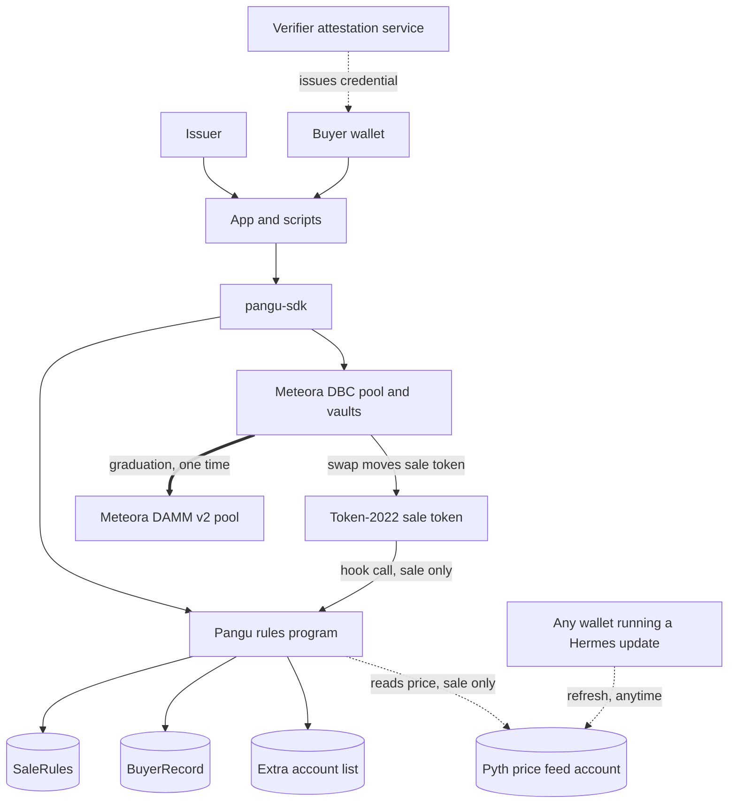
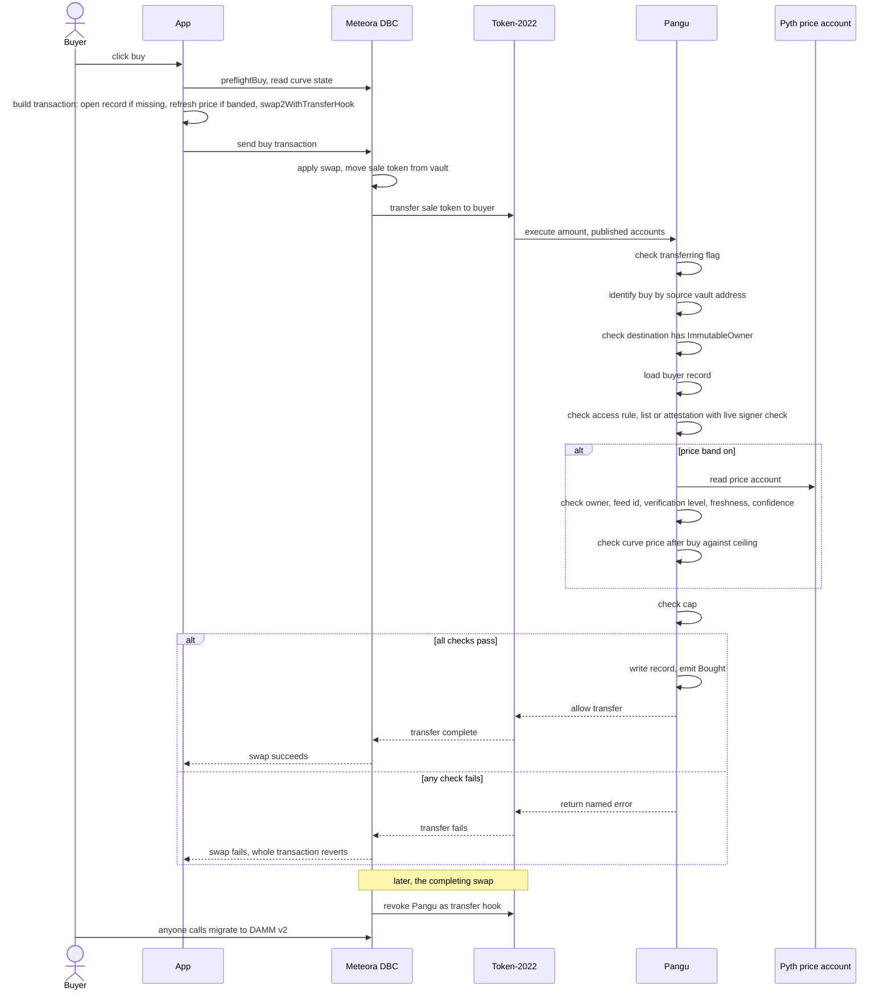
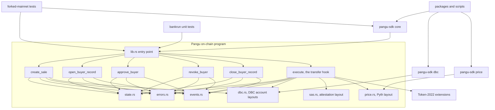

Meteora's Dynamic Bonding Curve can attach a small program, called a transfer hook, to a new token. From the moment the token is created, every single movement of it (every buy, every sell, every wallet-to-wallet send) has to pass through that hook before Solana lets it happen. Pangu is that hook. It has no other job.

## The four rules

While the sale is open, Pangu checks every movement of the token against four rules.

1. **A wallet cannot buy past its cap.** Each sale sets a limit on how many tokens one wallet can hold, counted net of anything it sells back. The limit is tracked per wallet, not per token account, so opening a second account to dodge it does not work.
2. **A wallet must be allowed to buy, if the sale requires that.** An issuer can run the sale wide open, or require buyers to be on an approved list the issuer manages, or require buyers to hold a credential from a verifier (a Solana attestation, the same kind of technology used for on-chain identity checks).
3. **A buy cannot push the price too far above the real stock's price, if the sale has a ceiling.** This only applies to sales that turn it on, and it compares the curve's price in dollars per token against a live price feed for the real stock, sourced from Pyth (a widely used price oracle). It only ever blocks a buy that would go too high. It never blocks a sell, and it never blocks a buy at or below the real price.
4. **Tokens can only move between a wallet and the sale's own pool, never wallet to wallet, while the sale is running.** This closes the obvious way around the first three rules: pool tokens with a friend, or hand a full account to someone who was not approved.

Selling back to the pool is always allowed, no matter what. Nothing about the cap, the approval list, or the price ceiling can ever block an exit.

## What a sale must get right to open

Before any of that, the program checks how the sale was set up, and refuses to open one that would hurt its buyers. Each refusal comes back by name.

- **A sale with a price ceiling must be priced in a dollar token.** The ceiling compares the curve's price with a stock price in dollars. If buyers paid in SOL the two numbers would be in different units and the ceiling would mean nothing.
- **The issuer cannot pick a paying token they are able to freeze.** Whoever can freeze the paying token can freeze the pool's account or a seller's, and a frozen account cannot be paid. That would put the exit in the issuer's hands.
- **The per-wallet cap must sit below what the curve sells.** A cap as large as the whole sale would let one wallet buy all of it, the one thing a cap exists to stop.
- **Every sale names an offering period, or says plainly it has none.** The end is fixed when the sale opens and nobody can move it afterwards. An end that has already passed is refused.

## When the rules switch off

The rules switch off at graduation, or when the offering period ends, whichever comes first.

When the curve fills (enough buyers have bought that the sale reaches its threshold) Meteora's own code removes Pangu from the token, permanently, inside that very last trade. After that moment Pangu is never called again for that token, the four rules above stop applying, and the token trades freely like any other. The remaining liquidity moves automatically into a new Meteora pool (DAMM v2) so trading can continue with real depth behind it.

If the offering period ends first, Pangu stays attached to the token but lets every transfer through untouched from that moment, cap and approvals included, exactly as it would after graduation, and a buyer can close their record and take back its rent. This is what stops a curve that never fills from locking its buyers in for good. A sale opened with no end keeps its rules until graduation. The demo sale on devnet, PBAND2, ends on 7 October 2026.

## Why this has to be a transfer hook, and why that is the load-bearing choice

Every rule Pangu enforces depends on seeing every single movement of the token, not just the buys that go through Meteora's own trading interface. If Pangu were a separate program that buyers had to opt into, or a check the app made before sending a transaction, a buyer could simply skip it: buy through some other client, or send tokens wallet to wallet, and none of the four rules would ever run. Because Pangu is registered as the token's actual transfer hook at the Solana token-program level, there is no such path. Every transfer, from any app, from any wallet, calls Pangu first. That is what makes the rules real rather than a suggestion, and it is why the reference implementation, the tests, and every devnet transaction linked from this site are built around a real Meteora hook pool rather than a mock of one.

## Diagram 1: how the pieces fit together

The dotted arrows only exist while the sale is open: the hook call from the token program, Pangu's read of the price account, and the verifier's credential. The double arrow to DAMM v2 fires once, at graduation, and nothing points from Pangu to DAMM because Pangu is never called again after that trade.

## Diagram 2: one buy, start to finish

The checks run in the order shown, and the first one that fails ends the whole transaction, the swap included, with a named error. The last two lines happen on a later transaction: the swap that fills the curve is the one where Meteora removes Pangu as the hook, and after that any wallet, not just the buyer, can trigger the migration to the new liquidity pool.

## Diagram 3: how the code is organized

`execute`, the transfer hook, is the only instruction that touches every outside system Pangu depends on: Meteora's pool, the attestation service, and Pyth's price feed, plus the token program's own extensions. That is why almost every safety rule in the security page traces back to this one function.
